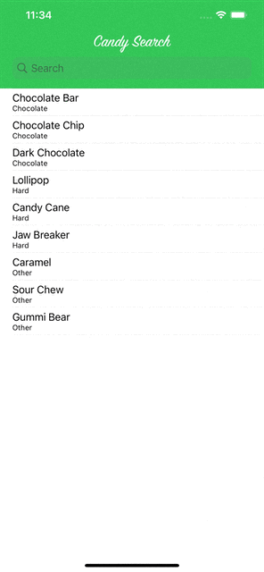

## 프로젝트 6 : CandySearch

##  날짜별 구현 사항

### 2023.06.20.
- [네비게이션 바 및 상태바 설정](https://github.com/AKAPUCH/Project6-CandySearch/commit/50b9810099946b55f2490137b833404aaf9ce2c0)

### 2023.06.22.
- [데이터 모델 파일 추가 및 테이블 뷰 구현](https://github.com/AKAPUCH/Project6-CandySearch/commit/de47de80d5570c70f079bc2a585cc01917e5177c)

### 2023.06.30.
- [검색 기능 구현](https://github.com/AKAPUCH/Project6-CandySearch/commit/e81562f27c36047196f89cb7f1054b8be84afa3e)
- [화면전환 및 디테일 뷰 구현](https://github.com/AKAPUCH/Project6-CandySearch/commit/20cec39b19b30786c67b7ea908f120d951aa0a85)
- [타이틀 이미지로 변경 및 카테고리 라벨 추가](https://github.com/AKAPUCH/Project6-CandySearch/commit/2892619514f0ed79c9042d938d50b297d122118f)
- [코드 정리 및 주석 추가](https://github.com/AKAPUCH/Project6-CandySearch/commit/49533197f36a336ae1560933219e8c64afe96b8c)

## 실제 화면

